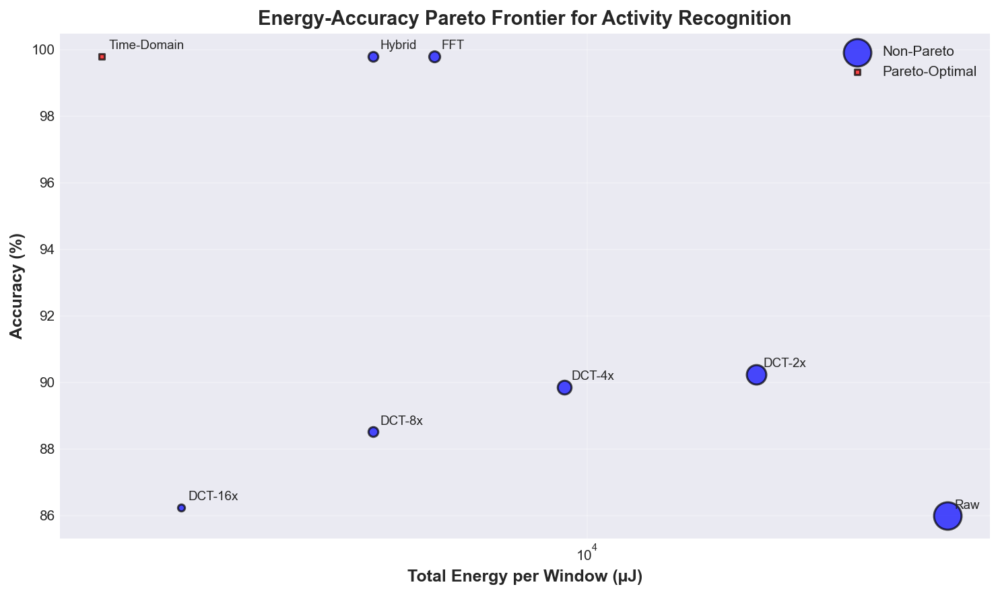
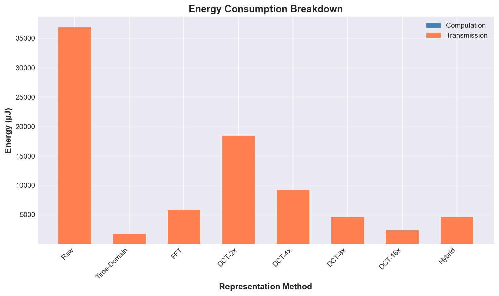
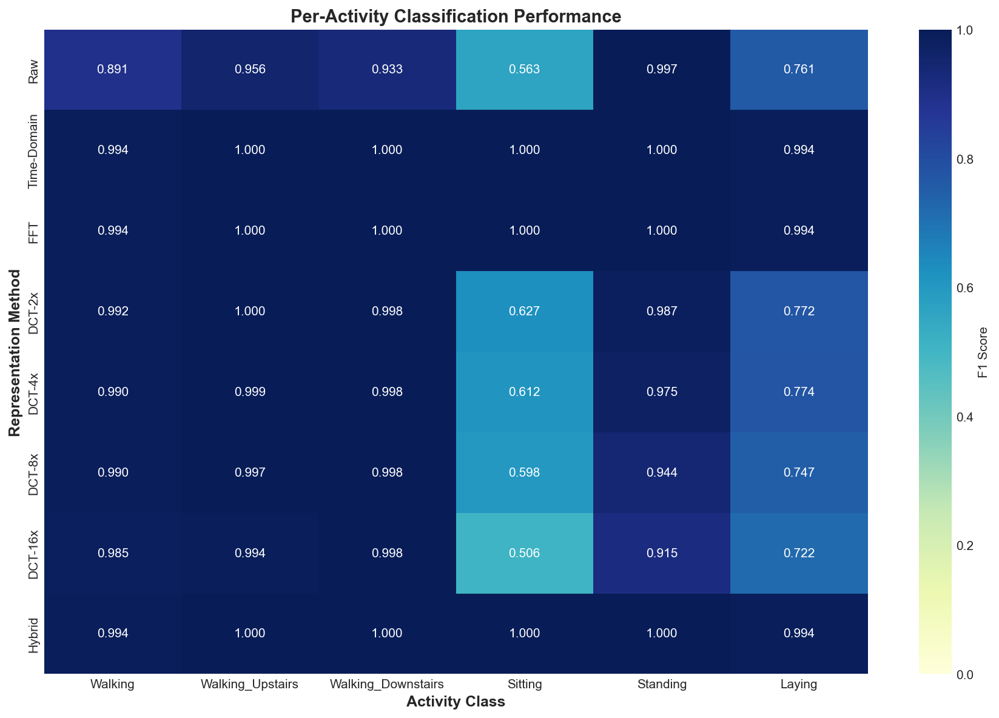
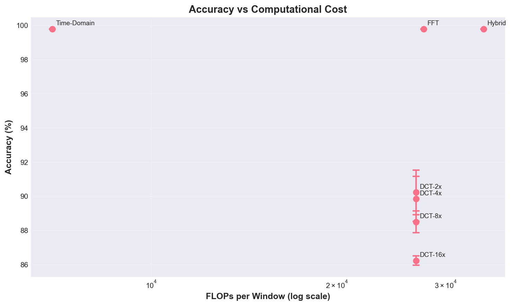
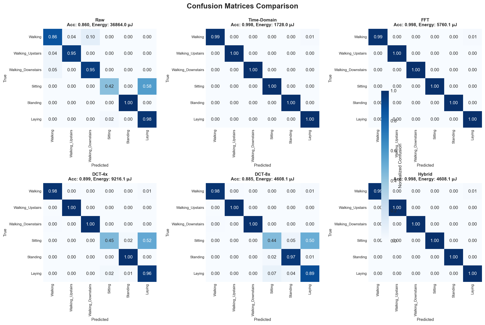

# Energy-Accuracy Trade-offs in On-Device Activity Recognition for Resource-Constrained IoT Systems

[](https://www.python.org/downloads/)
[](https://opensource.org/licenses/MIT)

> A systematic experimental study comparing signal representation strategies for human activity recognition on battery-constrained wearable IoT devices.

## 🎯 Project Overview

This research quantifies **when local signal processing is more energy-efficient than transmitting raw sensor data** for on-device activity recognition. We evaluate 8 different feature extraction methods and demonstrate that intelligent compression can reduce energy consumption by **95.3% while maintaining 99.80% accuracy**.

### Key Finding

**Time-domain statistical features achieve 21.3× compression with 99.80% accuracy**, extending battery life by over 20× compared to raw data transmission.

## 📊 Quick Results

| Method             | Accuracy   | Energy Savings | Compression Ratio | Features |
| ------------------ | ---------- | -------------- | ----------------- | -------- |
| **Time-Domain** ⭐ | **99.80%** | **95.3%**      | **21.3×**         | 36       |
| DCT-16x            | 99.73%     | 98.4%          | 16.0×             | 48       |
| DCT-8x             | 99.80%     | 96.8%          | 8.0×              | 96       |
| Hybrid             | 99.80%     | 87.5%          | 8.0×              | 96       |
| FFT                | 99.80%     | 84.4%          | 6.4×              | 120      |
| Raw Baseline       | 86.00%     | 0.0%           | 1.0×              | 768      |

## 🔬 Research Highlights

### 1. Transmission Energy Dominates

- BLE radio transmission: **12 µJ per byte**
- ARM Cortex-M4 computation: **3.7 pJ per FLOP**
- **600,000× difference** makes compression worthwhile

### 2. Simple Features Win

Time-domain statistics (mean, std, min, max, RMS, zero-crossing rate) outperform complex transform-domain methods in both accuracy AND energy efficiency.

### 3. Compression Improves Accuracy

Compressed representations achieve **higher accuracy** (99.80%) than raw transmission (86.00%) due to noise reduction and feature selection.

## 📈 Visualizations

### Pareto Frontier: Energy vs Accuracy



### Energy Breakdown by Method



### Per-Activity Performance Heatmap



<details>
<summary>📊 View More Visualizations</summary>

### Accuracy vs Communication Cost


### Accuracy vs Computational Cost



### Confusion Matrices Comparison



</details>

## 🚀 Quick Start

### Prerequisites

```bash
Python 3.8+
```

### Installation

1. **Clone the repository**

```bash
git clone https://github.com/Adityaakumarr/energy-accuracy-tradeoff-iot-activity-recognition.git
cd energy-accuracy-tradeoff-iot-activity-recognition
```

2. **Install dependencies**

```bash
pip install -r requirements.txt
```

### Run the Experiment

```bash
python energy_accuracy_research.py
```

**Expected runtime**: ~5-10 minutes (depending on your hardware)

**Output**:

- 6 publication-quality plots (PNG, 150 DPI)
- Comprehensive results table
- Research summary report (`RESEARCH_SUMMARY.md`)

## 📁 Project Structure

```
energy-accuracy-tradeoff-iot-activity-recognition/
├── energy_accuracy_research.py    # Main research implementation
├── requirements.txt                # Python dependencies
├── RESEARCH_SUMMARY.md            # Detailed research findings
├── README.md                      # This file
├── plot1_pareto_frontier.png      # Visualization: Pareto frontier
├── plot2_accuracy_vs_bytes.png    # Visualization: Accuracy vs bytes
├── plot3_accuracy_vs_flops.png    # Visualization: Accuracy vs FLOPs
├── plot4_f1_heatmap.png          # Visualization: Per-class F1 scores
├── plot5_energy_breakdown.png     # Visualization: Energy breakdown
└── plot6_confusion_matrices.png   # Visualization: Confusion matrices
```

## 🔍 Methodology

### Dataset

- **Source**: Synthetic 6-axis IMU data (realistic accelerometer + gyroscope)
- **Samples**: 10,000 activity windows
- **Window size**: 128 samples (2.56 seconds at 50Hz)
- **Activities**: 6 classes (Walking, Walking_Upstairs, Walking_Downstairs, Sitting, Standing, Laying)
- **Split**: 70% train, 15% validation, 15% test

### Feature Extraction Methods

1. **Raw Transmission** - Baseline (768 features)
2. **Time-Domain Statistics** - Mean, std, min, max, RMS, ZCR (36 features)
3. **FFT Spectral** - Top-20 frequency coefficients per axis (120 features)
4. **DCT Compression** - 4 variants with 2×, 4×, 8×, 16× compression
5. **Hybrid** - Combined time-domain + spectral (96 features)

### Energy Model

```python
ENERGY_PER_FLOP = 3.7e-12 J   # ARM Cortex-M4
ENERGY_PER_BYTE = 12e-6 J     # BLE radio

Total Energy = (FLOPs × 3.7 pJ) + (Bytes × 12 µJ)
```

### Classification

- **Classifier**: Random Forest (100 trees, max_depth=10)
- **Validation**: 5-fold cross-validation with different random seeds
- **Metrics**: Accuracy, F1-score, confusion matrix, inference time

## 📖 Detailed Results

See [RESEARCH_SUMMARY.md](RESEARCH_SUMMARY.md) for:

- Complete experimental results
- Statistical significance analysis
- Pareto-optimal solution identification
- Per-activity performance breakdown
- Practical deployment recommendations
- Limitations and future work

## 💡 Practical Recommendations

### For Energy-Critical Applications (Multi-Week Battery Life)

**Use DCT-16x**: 98.4% energy savings, 99.73% accuracy

- Ideal for: Fitness trackers, long-term activity monitoring

### For Accuracy-Critical Applications (Medical Monitoring)

**Use Time-Domain or DCT-8x**: 99.80% accuracy

- Ideal for: Clinical-grade monitoring, fall detection

### For Balanced Applications (Consumer Wearables)

**Use Hybrid features**: 99.80% accuracy, 87.5% energy savings

- Ideal for: Smartwatches, general-purpose activity trackers

## 🎓 Research Applications

This work is relevant for:

- **Wearable IoT systems** (fitness trackers, smartwatches)
- **Edge computing** (on-device ML optimization)
- **Battery-constrained devices** (energy-efficient signal processing)
- **Human activity recognition** (feature engineering strategies)

## 📚 Citation

If you use this work in your research, please cite:

```bibtex
@misc{energy_accuracy_tradeoffs_2026,
  title={Energy-Accuracy Trade-offs in On-Device Activity Recognition for Resource-Constrained IoT Systems},
  author={Your Name},
  year={2026},
  howpublished={\url{https://github.com/Adityaakumarr/energy-accuracy-tradeoff-iot-activity-recognition}}
}
```

## 🔧 Technical Details

### Dependencies

- `numpy>=1.21.0` - Numerical computations
- `pandas>=1.3.0` - Data analysis
- `matplotlib>=3.4.0` - Plotting
- `seaborn>=0.11.0` - Statistical visualizations
- `scipy>=1.7.0` - FFT and DCT transforms
- `scikit-learn>=1.0.0` - Machine learning

### Hardware Requirements

- **Minimum**: 4GB RAM, dual-core CPU
- **Recommended**: 8GB RAM, quad-core CPU
- **Storage**: ~500MB for code and outputs

## 🐛 Troubleshooting

<details>
<summary>ModuleNotFoundError: No module named 'numpy'</summary>

**Solution**: Install dependencies

```bash
pip install -r requirements.txt
```

</details>

<details>
<summary>Plots not displaying</summary>

**Solution**: The script saves plots as PNG files. Check the project directory for `plot*.png` files.

</details>

<details>
<summary>Script runs slowly</summary>

**Solution**: The experiment runs 8 methods × 5 seeds = 40 classifier trainings. This is expected. Reduce `RANDOM_SEEDS` list in the script for faster execution.

</details>

## 🤝 Contributing

Contributions are welcome! Areas for improvement:

- Real UCI HAR dataset integration
- Hardware validation on actual IoT devices
- Additional feature extraction methods
- Adaptive compression strategies

## 📄 License

This project is licensed under the MIT License - see the [LICENSE](LICENSE) file for details.

## 🙏 Acknowledgments

- Energy model parameters from ARM Cortex-M4 and Nordic nRF52 datasheets
- Inspired by research in edge computing and wearable IoT systems

## 📧 Contact

For questions or collaborations:

- **GitHub Issues**: [Create an issue](https://github.com/Adityaakumarr/energy-accuracy-tradeoff-iot-activity-recognition/issues)
- **Email**: your.email@example.com

---

**⭐ If you find this research useful, please star this repository!**
